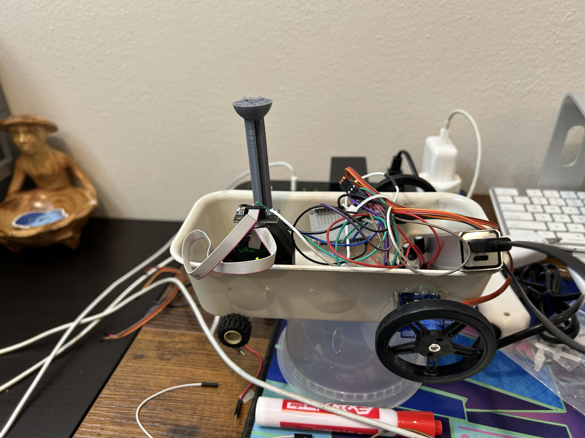

# encoder training reinforce*

In this project, a reinforcement learning model has been deployed onto a drive base. The goal is for the model to be able to balance a freely rotating pole by moving forward and backward.

The model was first trained in the OpenAI Gym `CartPole-v1` environment. Once trained, it was fine-tuned on the drive base.

This drivebase was driven by two continuous servos, controlled by an ESP32-WROOM. A Vex encoder has the shaft with the pole (rocket in this case).
 

### [Watch]() the drivebase in action.

  
<i>*Name suggested by pikaboy511</i>